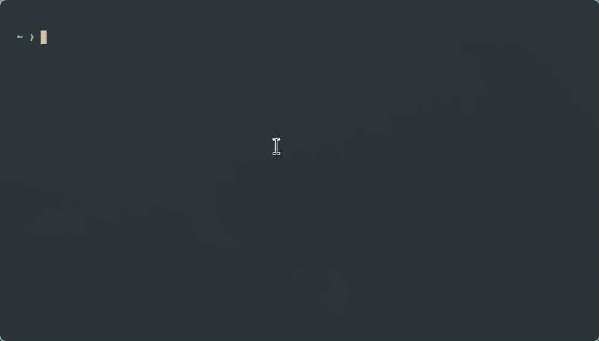

# Ghost

Lightweight Bash enhancements for inline suggestions and interactive completion.


## Features

* **Ghost suggestions** — Fish/Zsh-style inline history suggestions.
* **Interactive completion** — Navigate Tab completions with arrows, Tab, or Shift-Tab.
* **Pure Bash** — No plugins or external dependencies.

<p align="center">
  
</p>

## Install

```bash
git clone https://github.com/h-jangra/Ghost.sh.git
cd Ghost.sh
```

Add to `~/.bashrc`:

```bash
source /path/to/Ghost.sh/ghost.sh
source /path/to/Ghost.sh/navigation.sh
```

Reload:

```bash
source ~/.bashrc
```

## Keybindings

| Key               | Action                  |
| ----------------- | ----------------------- |
| `Tab` / `→`       | Next completion         |
| `Shift-Tab` / `←` | Previous completion     |
| `↑` / `↓`         | Navigate grid           |
| `Enter`           | Accept                  |
| `Esc` / `Ctrl-C`  | Cancel                  |
| `Right Arrow`     | Accept ghost suggestion |

## Requirements

* Bash 4+
* ANSI-compatible terminal

